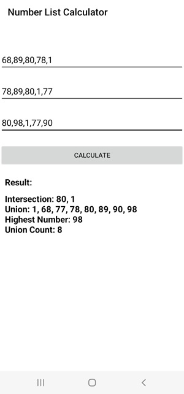

# Number List Calculator

This Android app allows users to enter lists of numbers and calculates the intersection, union, and highest number among the lists.

## Screenshots

## Getting Started

To get started with this project, clone the repository and open it in Android Studio.

## Features

- Enter lists of numbers in the three input fields.
- Calculate the intersection, union, and highest number.
- View the results on the screen.

## Usage

1. Enter comma-separated numbers in each input field.
2. Click the "Calculate" button to see the results.

Contributions are welcome! Fork the repository and submit a pull request.

## License

This project is licensed under the MIT License - see the LICENSE.md file for details.
